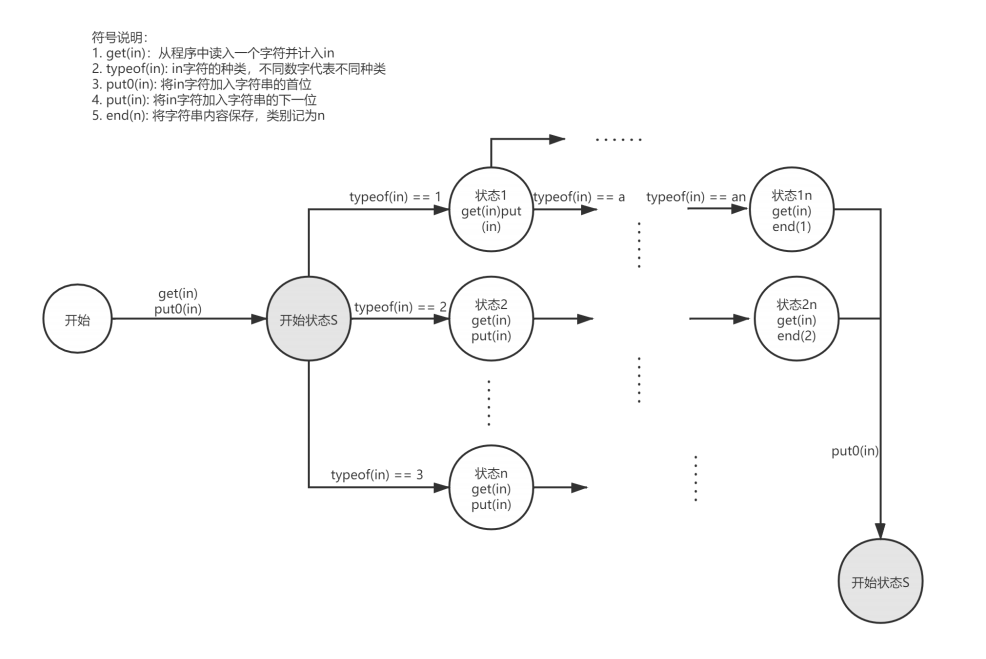
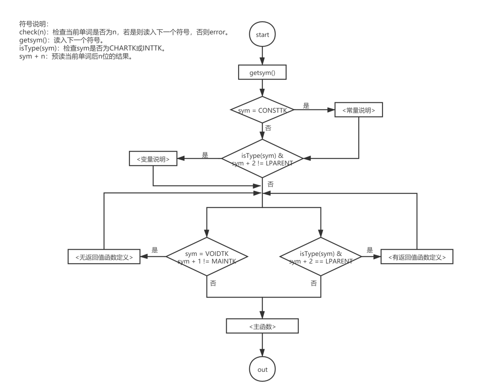

# 编译原理课程设计总文档

*吕云帆 18373763*

## 词法分析

### 一、架构概述

本次作业的目标是分析程序中出现的单词，并记录其类别与单词值。为了方便地识别单词的类别，我采用了**状态机**的架构。

在我的设计中，程序实现大体如下：

* 状态机中单词开始状态与结束状态为同一状态 `S` ，一个单词的结束状态等于下一个单词的开始状态

* 按字符依次读取程序内容，并按字符改变状态机的状态以决定下一步处理
* `S` 状态之后马上根据进入该状态的字符进入下一状态，以确定单词类别
* 从每次 `S` 状态开始将之后读取的字符单独保存成字符串，到下一次进入 `S` 状态时结束（不包括进入下一次 `S` 状态读取到的单词），这时保存的字符串即一个单词

状态机大体图示如下：



### 二、细节详述

1. 成功判断一个单词结束（即读到下一个单词的开头）之后，立刻保存单词并继续下一次循环。循环开头不读取字符，保证直接使用单词开头进行判断

   循环大体结构如下：

   ```
   fgetc(c);
   while(c != EOF) 
   {
   	if (c == ...)
   	{
   		...
   		fgetc(c);
   		if (end)
   		{
   			continue;
   		}
   	} 
   	else if (c == ...)
   	{
   		...
   		fgetc(c);
   	}
   	...
   }
   ```

2. 类别分类

   | 状态机分类 | 分类对应单词                           |
   | ---------- | -------------------------------------- |
   | 词语       | 标识符、保留字（const, int, char等等） |
   | 单字符符号 | + - * / : ; , ( ) [ ] { }              |
   | 双字符符号 | < <= > >= = == !=                      |
   | 字符串     | 字符串常量                             |
   | 字符       | 字符常量                               |
   | 数字       | 整形常量                               |

   注：

   * 为了方便处理，将标识符和保留字做同类读取，在读取完之后再判断是否为保留字
   * 双字符符号指读取第一个字符后无法立即判断其是什么单词的符号

3. 类别处理方针

   | 分类       | 开始字符                    | 中间处理及结束标志                                           |
   | ---------- | --------------------------- | ------------------------------------------------------------ |
   | 词语       | _ a-z A-Z                   | 如果读取到- a-z A-Z 0-9则继续，否则结束                      |
   | 单字符符号 | + - * / : ; , ( ) [ ] { }   | 读取下一个字符并结束                                         |
   | 双字符符号 | < ! > =                     | 读取下一个字符，若：<br />下一个字符是 = ，则读取下一个字符并结束<br />下一个字符不是 = ，则直接结束 |
   | 字符串     | “（该符号不加入单词字符串） | 读取到下一个 “ 后，读取一个字符并结束<br />” 符号不加入单词字符串 |
   | 字符       | ‘（该符号不加入单词字符串） | 读取到下一个 ‘ 后，读取一个字符并结束<br />’ 符号不加入单词字符串 |
   | 数字       | 0-9                         | 如果读取到0-9则继续，否则结束                                |

   注：

   * 该表内的处理方针不含错误处理

### 三、预留接口

在本次设计中，我给之后的错误处理预留了部分接口。主要是对单词的处理与结束标志增加了限制，如果读到此处不应该读到的字符，则进入错误处理环节。

大体如下：

* 出现如 % $ 等在文法中没有的终结符号
* 在 ! 后面出现非 = 的字符
* 在 ' ' 里出现不应该出现的字符
* 不合规范的字母数字组合

## 语法分析

### 一、概述

本次设计延续之前词法分析阶段的设计，以词法分析得到的单词集合为基础进行开发。

考虑到文法并不存在左递归，故采用递归向下分析法。而对于无法一次性判断接下来的成分（即：需要回溯）的语法，采用提前预读的处理方法。

为了统一并便于处理，采用了以下处理：

* 使用 $sym$ 变量依次读取单词类型，并保证在进入每一个处理模块时 $sym$ 已读入第一个属于该模块的单词，固定使用 $getsym()$ 函数读取下一个单词，保证预读时不改变 $sym$ 的值。
* 对于模块中的固定终结符号（如：$A ::= ab | ac$ 中的 $a$），自定义 $check()$ 函数判断该单词是否符合期望，并读入下一个单词，这样处理是为了方便以后错误处理。
* 对于题目要求输出，词法部分跟随 $getsym()$ 函数输出，保证在读入下一个单词时输出上一个单词的相关信息。而语法部分则在结束每个分析模块时使用 $outSym()$ 函数统一输出。统一的目的是为了之后的开发便于修改。

对于所有后续分析不带分歧的文法，直接中规中矩地递归向下，而对于带分歧的文法，则预读数个单词以做出正确判断。为了避免冗长的说明，下述具体实现将只展示 <程序> 的流程图，以做示例。其他部分则只说明特殊处理的地方，以文字描述。

### 二、具体实现

该文法的识别符号是 <程序>，故以 <程序> 为顶层，进行自顶向下分析。<程序> 分析函数流程如下：



特殊处理说明：

* 在 <程序> 中，<变量说明> 与 <有返回值函数定义> 开始部分完全相同，故采用预读判断（如上流程图）。

* 变量定义分为有初始化与无初始化两种，变量分为标量、一维、二维三种，三种仅有些微不同。故即使用上预读手段，也不容易将其区分为完全独立的两个分析函数。故在实际实现中，将两种情况一并分析，采用预读的方式一并判断。
* <语句> 部分有许多种情况，采用预读辅助判断。
* <有返回值函数调用语句> 与 <无返回值函数调用语句> 内容完全相同，只能通过记录标识符的方式分辨。故在 <有返回值函数定义> 与 <无返回值函数定义> 分析函数里，分别记录两种函数的标识符，以辅助判断。

## 错误处理

#### 一、概述

本次错误处理主要是能够正确识别一部分所给的错误，主要工作量在于正确建立符号表并存储信息，并做到能够顺利查询符号表。

我在本次作业中新增的数据结构如下：

```
typedef enum type {	// 符号表中的类型项
    ERROR_T,	// 错误
    VAR,
    CONST,
    FUNC,
    ARRAY
}type;

typedef enum data_type {	// 符号表中的数据类型项
    ERROR_DT,	// 错误
    INT,
    CHAR,
    VOID
}dtype;

typedef struct symbol {	// 符号表项
    int n;	// 行号
    type t;	// 类型
    dtype dt;	// 数据类型
    string s;	// 标识符名
    int d;	// 数组维数
    int v1; // 函数参数数量
    vector<dtype> para; //函数参数数据类型表
}symbol;
```

#### 二、具体实现描述

接下来我将具体讲述一些比较关键的过程，顺带穿插着描述错误的处理方式，最后会列出一个表格来总结。

**1. 符号表**

为了区分符号的作用域，我建立了两张符号表（全局与局部），局部符号表会在每个函数语法分析完后清空。

至于建表过程，主要是在 `<有返回值函数定义>`、`<无返回值函数定义>`、`<主函数>`、`<变量定义>`、`<常量定义>` 中增加相应的语句，需要注意的点如下：

* 函数定义需要把参数表加入符号表
* 建立过程需要同步判断是否有名字重定义，即错误 `'b'` 
* 在对变量定义中的数组进行语法分析时，需要同时判断初始化个数是否匹配

而符号表的读取主要是在于判断符号是否存在与变量 / 函数的类型、数据类型。

对于符号表的操作无论是建立还是读取，都封装在函数里，以简化操作，便于 DEBUG。

**2. 表达式的类型**

表达式的类型判断在很多需要判断类型是否匹配的地方有用，也算是关键步骤。

设计使用递归判断，即给因子、项、表达式分别加上 dtype 型返回值。具体判断依据如下：

* 在项和表达式中，单因子之外均返回 int
* 在因子中，仅有 char 型变量、常量（含数组）函数以及字符返回 char

**3. 表格**

| 错误类型                                             | 码   | 处理方式                                                     |
| ---------------------------------------------------- | ---- | ------------------------------------------------------------ |
| 非法符号或不符合词法                                 | a    | 直接在词法分析中加入判断，并做合理处理保证词法分析能够继续   |
| 名字重定义                                           | b    | 报错封装在符号表添加项函数里                                 |
| 未定义的名字                                         | c    | 报错封装在查找函数里                                         |
| 函数参数个数不匹配                                   | d    | 给值参数表增加 string 参数，传入函数名，并查找对应 symbol，利用 v1 与 para 域匹配 |
| 函数参数类型不匹配                                   | e    | 同上                                                         |
| 条件判断中出现不合法的类型                           | f    | 利用表达式的返回值判断                                       |
| 无返回值的函数存在不匹配的return语句                 | g    | 定义全局变量指示当前函数类型（void / char / int)，并在 `<返回语句>` 中增加相应判断进行处理 |
| 有返回值的函数缺少return语句或存在不匹配的return语句 | h    | 同上                                                         |
| 数组元素的下标只能是整型表达式                       | i    | 利用表达式的返回值判断                                       |
| 不能改变常量的值                                     | j    | 在赋值语句、for 循环语句、scanf 语句里增加判断               |
| 应为分号                                             | k    | 在语法分析中封装的 check 函数中直接判断，并在出现此类错误后不往后读一个单词 |
| 应为右小括号’)’                                      | l    | 同上                                                         |
| 应为右中括号’]’                                      | m    | 同上                                                         |
| 数组初始化个数不匹配                                 | n    | 在对变量定义进行语法分析时同步进行                           |
| &lt;常量&gt;类型不一致                               | o    | 直接判断即可                                                 |
| 缺少缺省语句                                         | p    | 直接判断即可                                                 |

## 代码生成

### 1. 中间代码设计

#### 概述

在中间代码生成中，求值是最关键的一部分，在使用所有值之前，必须保证其值已经正确计算出来。在我们的程序中，所有计算过程均是 `<表达式>` 文法成分执行的，所以 `<表达式>` 的设计可谓是关键。只要值能够正确求出，并保证对值的使用在求值之后，就不会出问题。

此外，函数调用是另一个比较困难的部分。考虑到嵌套调用的可能（即在参数里又调用函数），我将所有参数赋值统一放在了函数的最后，通过栈式结构保证参数分配的正确性。

#### 详细设计

**表达式**

表达式的求值应该自底向上的，即按照 `因子 -> 项 -> 表达式` 的顺序求值。为了方便计算，引入临时变量（符号表项类型是 `TEMP`。在每次需要求值表达式之前，分配一个临时变量，并将该变量作为接受结果的元传入表达式分析函数；在表达式分析中，为每一个项分配一个临时变量，并将变量信息传入项的分析函数中，作为接受结果的目标，因子同理。

**函数调用**

函数调用过程中，首先在值参数表分析部分计算每个表达式的值，并**依次**将保存结果的临时变量入栈，同时在值参数表分析完成时将相应数量的参数出栈并分配。这样可以保证每次函数调用都能分到自己需要的参数。

**常数、常量**

符号表类型为 `CONST`，以及在符号表项中用 `value` 属性存储值，依然直接作为中间代码中的元，在后面 MIPS 代码生成里有着与变量不同的处理，在代码优化中也起到了重要的作用。

#### 具体实现

采用“四元式”设计（事实上保存的信息量远不止四元），每个元中都保存**符号表项**，里面包含了该元的全部信息，以方便读取需要的信息进行代码生成及优化。

| 作用           | 标识符 | 结果   | 操作数1    | 操作数2     | 其他信息     |
| -------------- | ------ | ------ | ---------- | ----------- | ------------ |
| +              | PLU    | 结果   |            |             |              |
| -              | MI     | 结果   | 被减数     | 减数        |              |
| *              | MU     | 结果   |            |             |              |
| /              | DI     | 结果   | 被除数     | 除数        |              |
| 写字符串       | PSTR   |        | 字符串标号 |             |              |
| 写换行         | PN     |        |            |             |              |
| 写字符         | PCHAR  |        | 标识符     |             |              |
| 写整数         | PINT   |        | 标识符     |             |              |
| 读字符         | SCHAR  | 目标   |            |             |              |
| 读整数         | SINT   | 目标   |            |             |              |
| 赋值           | TO     | 目标   | 值         |             |              |
| 无条件跳转     | J      | 标签   |            |             |              |
| ==             | BEQ    | 标签   | 条件       |             |              |
| !=             | BNE    | 标签   | 条件       |             |              |
| <              | BLTZ   | 标签   | 条件       |             |              |
| <=             | BLEZ   | 标签   | 条件       |             |              |
| >              | BGTZ   | 标签   | 条件       |             |              |
| >=             | BGEZ   | 标签   | 条件       |             |              |
| 标签           | IND    |        | 标签标识符 |             |              |
| 取数组         | AR     | 目标   | 取什么     | 维数1标识符 | 维数2标识符  |
| 写数组（定义） | AWD    | 目标   | 写什么     |             |              |
| 写数组         | AW     | 目标   | 写什么     | 维数1标识符 | 维数2标识符  |
| 函数开始       | FUNIN  |        | 标识符     |             |              |
| 函数结束       | FUNOUT |        | 标识符     |             |              |
| 返回           | RET    | 目标   | 返回值     |             |              |
| 取返回值       | GETR   | 标识符 |            |             |              |
| 参数分配       | PARATO |        | 标识符     |             | 参数相对位置 |
| 函数调用       | CALL   |        | 标识符     |             |              |
| main开始       | MSP    |        |            |             |              |
| 移动到main     | TOMAIN |        |            |             |              |

**条件**

所有形如 `a op b` 的条件都采用更改为 `a - b op 0` 的方式进行比较，以方便代码生成。

`<条件语句>` 中，若不满足条件则跳转至 `if` 结尾（若有 `else`，则后面是 `else`），若满足条件则在语句列结束后跳到整个语句结尾。

**写数组**

在定义部分，为数组赋值时的下标均是确定的常数，故单独设立指令（事实上没有这个必要）。

**返回**

对于 `<返回语句>`，均采取跳转至该函数结尾（即 `FUNOUT` 指令部分），故需要预存每个返回语句属于哪一条。

特别的，在程序最后单独输出 `main` 函数的结束标签。

**main 开始 & 移动到 main**

在 `<常量说明>` `<变量说明>` 结束之后跳转到 `main` 函数，保证 `main` 函数率先执行。

### 3. MIPS 代码设计

#### 总方针

为了方便处理，在设计初期，我采取将所有变量（含临时变量）均放进内存，保证所有中间代码执行完成后，结果均存进内存。这样内存开销很大，但是正确率可以得到充分的保证。

#### 地址分配

如前所述，所有数据均储存于内存里。在内存里，我的利用主要分为三部分：静态数据、全局变量、栈空间。其中静态数据存储字符串内容，栈空间存储 main 及函数里的变量（含临时变量）。

1. 静态数据：在词法分析阶段，维护一个字符串表，为所有字符串编号，并存储每个字符串对应的编号。在 mips 代码初则用 `.asciiz` 的形式输出字符串表，而字符串的输出则通过此表输出；
2. 全局变量 & 临时变量：对于全局变量分配绝对地址，而临时变量则分配 sp 空间内的相对地址。在语法分析阶段，同时进行地址的分配。在语法分析中，在程序开始初以及每次进入新的函数定义（含主函数）子程序时，重置一个**相对地址变量**，之后在 `<变量定义>` `<参数表>` 以及临时变量生成函数中，对于每个变量分别分配，并将相对地址变量增加变量大小的值（主要是数组大小不同），以此来依次分配变量。这样，每个变量在符号表中就会存储以下信息：局部 or 全局、分配到的地址。

这样的分配方针在之后代码生成阶段之所以能够成立，还是取决于中间代码中存储符号表项的设计。这样，在生成代码时，可以直接读取表项里的信息获得地址，方便存取。

#### 地址存取

对于地址的存取操作，封装 `load` 和 `save` 函数，分别在全局、局部，变量、常量时输出不同的指令进行地址的存取。特别需要注意的是数组的处理，数组需要计算偏移量，故需要在存取数组时使用另外的策略。

对于取值，如果输入是常量，则使用 `li` 指令，若是变量则用 `lw`。

#### 函数传参

对于主函数之外的函数，会预留部分空间用于保存环境，在我的程序中，主要用于保存 sp 与 ra 的值。所以，之前的**相对地址变量**重置实则为 $8$。而对于参数，按照语法分析顺序，会首先被分配地址，之后再是局部变量与临时变量。

每当调用函数，中间指令执行顺序为：`表达式计算 -> PARATO（参数传递）-> CALL（调用）-> GETR（取返回值）`。其中，`PARATO` 主要从内存中取值并存储到函数栈中下一个区域的相应位置（注意，这时的 sp 寄存器还在原函数位置），而 `CALL` 则负责保存环境（也保存在下一个函数的栈里），之后就跳转至函数入口。`GETR` 则负责将 a1 寄存器中的值存至相应内存位置（与 MIPS 习惯不同，我使用 a1 寄存器传递返回值）。

在函数体部分，执行顺序是：`FUNIN（函数入口） -> ...（函数语句） (-> RET（返回语句）) -> FUNOUT（函数出口）`。`FUNIN` 的任务是移动 sp 寄存器至下一个函数栈，`RET` 将返回值保存到 a1 寄存器并跳转至函数出口，而 `FUNOUT` 则首先执行跳转，然后恢复环境（sp 与 ra 寄存器）。

### 4. 代码优化

在之前的处理中，即使是常数的运算也需要单独分配一个临时变量并进行内存操作，效率极低（事实上初代程序也确实超时了），故优化主要是以常数传递为中心，还进行了一些其他小优化。

#### 中间代码优化

主要对常数进行优化，如果某**临时变量**的计算操作数均是变量，则将该句中间代码删除（指令类型 `NON`），并将临时变量的类型更改为 `CONST_TEM` 同时更新 `value`，然后将该变量加入**临时常数库**中。

之后，`CONST` 类型和 `CONST_TEM` 类型均当作常数类型处理。

在遍历每句中间代码时，更新四元式的每个元，更新方针如下：

* 对于操作数，如果临时常数库中有同名符号表项，则用临时常数替代原临时变量；
* 对于结果，如果结果是临时变量，且操作数不全是常数类型，则将结果从临时常数库移除。

对于第一个更新规则，主要针对以下中间指令：`PLU` `MI` `MU` `DI` `GETR` `AR`，也就是所有可能使用 `save` 指令写入内存的指令。

#### MIPS 代码优化

主要对常数类型进行优化，并优化了一些其他细节上冗余的操作。

* 乘法：
  * 双常量则直接计算并保存
  * 单常量且为 $0$ 则直接保存结果 $0$
  * 单常量且为 $1$ 则直接保存变量
  * 单常数且为 $2$ 的幂次则用 `sll` 代替 `mult`，$2$ 的幂次相反数则移位后置相反数
* 除法：
  * 双常量则直接计算并保存
  * 被除数为 $0$ 则直接保存结果 $0$
  * 除数为 $1$ 则直接保存变量
  * 单常数且为 $2$ 的幂次或其相反数则用 `srl` 代替 `div`，其间需要判断正负做不同处理
* 加法：
  * 双常量则直接计算并保存
  * 单常量则用 `addiu` 代替 `addu`，若是 `0` 则直接保存
* 减法
  * 双常量则直接计算并保存
  * 被减数是常量则将除数取反后用 `addiu` 代替 `subu`，若是 `0` 则直接取反
  * 减数是常量则用 `addiu` 代替 `subu`，若是 `0` 则直接保存
* 读、写数组
  * 如果两维均为常量，则直接计算后取值
  * 如果第一维为常量（一维数组固定为零也属于这种情况），则计算第一维后加上第二位并移位即可
  * 如果第二维为常量，则计算后直接将第二维加入偏移，不需要额外计算

